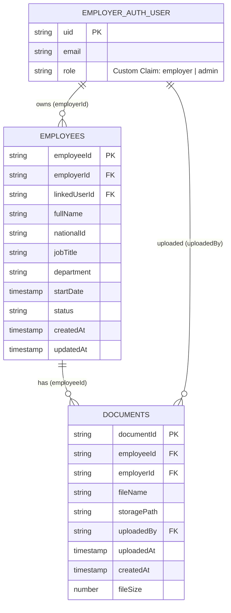

# HRIS Platform — Technical Assessment Submission

> Multi-tenant HR platform built with React.js, Firebase (Auth, Firestore, Storage), Node.js Cloud Functions, and Vercel.

---

## Table of Contents

1. [Architecture Overview](#architecture-overview)
2. [Environment Variables Reference](#environment-variables-reference)
3. [Local Setup Guide](#local-setup-guide)
4. [Data Model Design](#data-model-design)
5. [ER Diagram](#er-diagram)
6. [Auth Flow](#auth-flow)
7. [File Lifecycle](#file-lifecycle)
8. [Security Audit](#security-audit)
9. [Automated Backups](#automated-backups)
10. [Honest Gaps & What I'd Do Next](#honest-gaps--what-id-do-next)

---

## Architecture Overview

```
Browser (React SPA)
  │
  ├── Vercel CDN (serves static build)
  │
  ├── Firebase Auth ──── Custom Claims (role: employer | admin)
  │         │
  │         └── Admin SDK (Cloud Functions only — never client)
  │
  ├── Firestore ─────── Security Rules (per-employer isolation)
  │         │
  │         └── onCreate trigger ──→ Cloud Function ──→ SendGrid
  │
  ├── Firebase Storage ─ Security Rules (path-scoped to employerId)
  │
  └── GCS Bucket ←── Cloud Scheduler (daily Firestore export)
```

**Vercel** serves the compiled React bundle. No server-side rendering — all Firebase calls originate in the browser or in Cloud Functions.

**Firebase Auth** is the single source of truth for identity. Roles are encoded as Custom Claims on the JWT token, not as Firestore documents.

**Cloud Functions** run the only server-side Node.js logic: setting Custom Claims on user creation and sending emails via SendGrid on document upload.

**Firestore Security Rules** and **Storage Security Rules** enforce that every read/write is tied to the authenticated user's UID — no cross-employer access is possible at the data layer, regardless of what the React code does.

---

## Environment Variables Reference

All secrets are stored in `.env.local` (never committed). A `.env.example` with placeholder values is committed to the repo.

### React App (Vercel Environment Variables)

| Variable | What it contains | Where used |
|---|---|---|
| `REACT_APP_FIREBASE_API_KEY` | Firebase project public API key | `src/firebase.js` — initialises Firebase SDK |
| `REACT_APP_FIREBASE_AUTH_DOMAIN` | `<project-id>.firebaseapp.com` | `src/firebase.js` — Auth domain |
| `REACT_APP_FIREBASE_PROJECT_ID` | Firebase project ID | `src/firebase.js` — Firestore + Storage |
| `REACT_APP_FIREBASE_STORAGE_BUCKET` | `<project-id>.appspot.com` | `src/firebase.js` — Storage bucket |
| `REACT_APP_FIREBASE_MESSAGING_SENDER_ID` | FCM sender ID | `src/firebase.js` |
| `REACT_APP_FIREBASE_APP_ID` | Firebase app ID | `src/firebase.js` |

> **Note:** Firebase client config values (API key, auth domain, etc.) are **not secrets** — they are safe to expose in the browser bundle. Their security is enforced by Firestore and Storage Security Rules, not by keeping the config private. The Firebase API key is a project identifier, not an authentication credential.

### Cloud Functions (Firebase Environment Config)

| Variable | What it contains | Where used |
|---|---|---|
| `SENDGRID_API_KEY` | SendGrid API key | `functions/index.js` — sends transactional email |
| `SENDGRID_FROM_EMAIL` | Verified sender address | `functions/index.js` — email From field |
| `NOTIFICATION_TARGET_EMAIL` | Test recipient address | `functions/index.js` — email To field |

Set Cloud Function environment variables with:
```bash
firebase functions:config:set sendgrid.api_key="SG.xxxx" sendgrid.from_email="noreply@yourdomain.com" notification.target_email="test@yourdomain.com"
```

---

## Local Setup Guide

For a new developer joining the project:

```bash
# 1. Clone and install
git clone <repo-url>
cd hris-platform
npm install

# 2. Install Firebase CLI globally
npm install -g firebase-tools

# 3. Log in to Firebase
firebase login

# 4. Copy the environment template
cp .env.example .env.local
# Fill in your Firebase project values from the Firebase Console → Project Settings

# 5. Install Cloud Functions dependencies
cd functions && npm install && cd ..

# 6. Run locally
npm start                    # React app on localhost:3000
firebase emulators:start     # Auth, Firestore, Storage, Functions emulators
```

The `firebase.json` points the SDK to the local emulator suite when `REACT_APP_USE_EMULATOR=true` is set in `.env.local`.

---

## Data Model Design

> Written before writing any code, as required.

### Collection Structure Decision: Top-level collections vs Subcollections

I chose **top-level collections** with an `employerId` field rather than subcollections (e.g. `/employers/{id}/employees/{id}`).

**Reason 1 — Security Rules are simpler and more auditable.** With top-level collections, the entire access pattern is expressed in one rule block: `allow read, write: if request.auth.uid == resource.data.employerId`. With subcollections, the path segment `/employers/{employerId}/...` must be validated against the authenticated UID at every level — a missed level is a security hole. Flat structure makes the attack surface smaller.

**Reason 2 — Queries across employees work without Collection Group queries.** If I later need to query all employees with `status == "active"` for a given employer, a simple `.where("employerId", "==", uid).where("status", "==", "active")` works on the top-level collection with a composite index. Subcollection queries require `collectionGroup()`, which bypasses per-employer path isolation and requires extra rule logic to re-enforce it.

### How the structure prevents Employer A from reading Employer B's employees

Every employee document contains `employerId: <uid>`. The Firestore Security Rule reads:

```
allow read, write: if request.auth != null && request.auth.uid == resource.data.employerId;
```

Even if Employer A guesses a document ID belonging to Employer B, the rule rejects the read because `request.auth.uid` (Employer A's UID) will not equal `resource.data.employerId` (Employer B's UID). There is no client-side check to bypass — the rejection happens at Google's infrastructure level before any data is returned.

### How the model accommodates an employee getting their own login without migration

Each employee document has a `linkedUserId` field (nullable string). When an employee registers, a Cloud Function sets `linkedUserId` on their document. Security Rules are extended:

```
allow read: if request.auth.uid == resource.data.employerId
          || request.auth.uid == resource.data.linkedUserId;
```

No document migration, no schema change — just a new rule condition and a background function that populates the field.

### Firestore Indexes Required

| Collection | Fields | Type | Reason |
|---|---|---|---|
| `employees` | `employerId` ASC, `createdAt` DESC | Composite | List employees sorted by join date |
| `employees` | `employerId` ASC, `status` ASC | Composite | Filter active/inactive employees per employer |
| `documents` | `employeeId` ASC, `uploadedAt` DESC | Composite | List documents for an employee chronologically |
| `documents` | `employerId` ASC, `uploadedAt` DESC | Composite | List all documents for an employer |

These are defined in `firestore.indexes.json` and deployed via `firebase deploy --only firestore:indexes`.

### Collection Map

```
/employees/{employeeId}
  - employerId: string       (FK → Firebase Auth UID)
  - linkedUserId: string?    (FK → Firebase Auth UID, set when employee registers)
  - fullName: string
  - nationalId: string       (encrypted at rest via field-level logic in Cloud Function)
  - jobTitle: string
  - department: string
  - startDate: timestamp
  - status: "active" | "inactive"
  - createdAt: timestamp     (server-set, immutable)
  - updatedAt: timestamp     (server-set on each write)

/documents/{documentId}
  - employeeId: string       (FK → /employees/{employeeId})
  - employerId: string       (FK → Firebase Auth UID, for Security Rule matching)
  - fileName: string
  - storagePath: string      (full GCS path)
  - uploadedBy: string       (Firebase Auth UID)
  - uploadedAt: timestamp    (server-set via serverTimestamp())
  - fileSize: number         (bytes)
  - createdAt: timestamp     (server-set, immutable)
```

---

## ER Diagram


See `docs/er-diagram.mmd` for the Mermaid source.



**Fields that are server-set (never client-provided):**
- `createdAt` — set via `serverTimestamp()` on document creation; blocked from client override by Security Rules
- `updatedAt` — set via `serverTimestamp()` on every update by Cloud Function or server-side merge
- `uploadedAt` — set via `serverTimestamp()` in the upload handler

**Fields used as Security Rule path segments / foreign keys:**
- `employerId` on both `employees` and `documents` — matched against `request.auth.uid`
- `employeeId` on `documents` — used to verify the document belongs to one of the employer's employees

---

## Auth Flow

Step-by-step from credential submission to protected route rendering:

1. **User submits email + password** on the login form in React.
2. **`signInWithEmailAndPassword(auth, email, password)`** is called — Firebase Auth SDK sends credentials to Firebase Auth servers.
3. **Firebase Auth validates credentials** and returns a signed JWT (ID token) containing the user's `uid` and any Custom Claims (`role: employer` or `role: admin`).
4. **The Firebase SDK stores the token** in memory and refreshes it automatically every hour.
5. **`onAuthStateChanged` listener** in `AuthContext.jsx` fires, setting the `currentUser` state with the decoded token.
6. **`useAuth` hook** exposes `currentUser` and a `userRole` derived from `currentUser.reloadUserInfo.customAttributes` (or parsed from the decoded token claims).
7. **`ProtectedRoute` component** reads `userRole`. If the role matches the required role for the route, it renders the child component. If not, it redirects to `/unauthorized`.
8. **Token is attached to every Firestore/Storage request automatically** by the Firebase SDK. The Security Rules evaluate `request.auth.token.role` on every request server-side.

**Password reset flow:**
1. User clicks "Forgot password" → `sendPasswordResetEmail(auth, email)` is called.
2. Firebase sends a reset link to the user's email.
3. User clicks the link → Firebase Auth's hosted reset page handles the new password.
4. No custom backend code required.

---

## File Lifecycle

From upload click to email notification — every service touched in order:

1. **Employer clicks "Upload Document"** in React UI and selects a PDF.
2. **Client-side validation:** file type checked (`file.type === 'application/pdf'`), size checked (`file.size <= 10 * 1024 * 1024`). Rejected files never leave the browser.
3. **Storage path constructed:** `Documents/${employerId}/${employeeId}/${YYYY-MM}/${filename}.pdf`
4. **`uploadBytesResumable(storageRef, file)`** uploads the file to Firebase Storage. The Storage Security Rule verifies: (a) user is authenticated, (b) `employerId` in the path matches `request.auth.uid`, (c) file is `application/pdf`, (d) file is under 10MB.
5. **On upload completion,** `getDownloadURL()` is NOT used. Instead, the authenticated download is handled via a signed URL generated in a Cloud Function (see Security section).
6. **Firestore metadata document written:** `addDoc(collection(db, 'documents'), { employeeId, employerId, fileName, storagePath, uploadedBy: currentUser.uid, uploadedAt: serverTimestamp(), fileSize })`. The Firestore Security Rule verifies `employerId == request.auth.uid` and that `createdAt` is server-set.
7. **Cloud Function `onDocumentUploaded` triggers** on `onCreate` for the `documents` collection.
8. **Cloud Function fetches the employee record** from Firestore using the Admin SDK (bypasses Security Rules — safe because this is server-side code we control).
9. **Cloud Function calls SendGrid API** with the employee's name and a notification message. The SendGrid API key is read from `functions.config().sendgrid.api_key` — never the client bundle.
10. **Email is delivered** to the configured notification address.
11. **On error:** the Cloud Function logs the error to Cloud Logging and updates a `emailStatus` field on the document to `"failed"`. The Firestore document is never deleted or corrupted — the upload is considered successful regardless of email outcome.

---

## Security Audit

### Authentication

Firebase Auth protects the system at the identity layer. A valid employer account **cannot:**
- Read or write documents belonging to another employer (enforced by Firestore/Storage rules, not client code)
- Elevate their own role — Custom Claims can only be set by the Firebase Admin SDK running in Cloud Functions, which requires a service account with `roles/firebase.admin`
- Access admin-only routes or data — the `admin` claim is verified independently

An unauthenticated attacker **cannot:**
- Read any Firestore document (`allow read: if request.auth != null` is the minimum gate on every rule)
- Read or write any Storage file (same minimum gate)
- Trigger any Cloud Function that reads protected data (functions use Admin SDK which requires a valid service account — not available to public callers)

### Authorisation

**Firestore tenant isolation:** Every employee and document record carries an `employerId` field equal to the creating employer's Firebase UID. Every read/write rule checks `request.auth.uid == resource.data.employerId`. This check happens at Google's infrastructure level — it cannot be bypassed by modifying React code, intercepting network requests, or guessing document IDs.

**Storage tenant isolation:** Storage paths are `Documents/{employerId}/...`. The Storage rule reads:
```
allow read, write: if request.auth != null && request.auth.uid == employerId;
```
where `employerId` is extracted from the path wildcard. An employer cannot read files outside their path segment even if they know the exact file name.

**Admin access:** Admin routes and data access require `request.auth.token.role == 'admin'`. This claim is set by the Admin SDK and cannot be self-assigned.

### Why Custom Claims Are More Secure Than Firestore Role Fields

If roles were stored in a Firestore document (e.g. `/users/{uid}/role: "employer"`) and the client fetched that field to determine access, an attacker could:

1. **Escalate their own role client-side:** The client code reads `userDoc.role` and passes it to route guards. An attacker who can write to their own user document (a common misconfiguration) simply sets `role: "admin"` and the client renders admin views.

2. **Exploit a race condition / stale cache:** The client caches the role field. If an admin revokes a user's role in Firestore but the client still has the old value cached, the revoked user continues to have access until the next page reload.

Custom Claims are embedded in the Firebase JWT, which is issued and signed by Google's auth servers. The claim cannot be modified client-side — any tampering invalidates the signature. The Security Rules read `request.auth.token.role`, which comes directly from the verified JWT, not from any document the attacker can write.

### Secrets Management

| Secret | Location | Rotation procedure |
|---|---|---|
| Firebase client config | Vercel environment variables (not secrets — safe in client) | N/A |
| SendGrid API key | Firebase Functions config (`functions:config:set`) | Generate new key in SendGrid, run `functions:config:set`, redeploy functions |
| Firebase service account | Never in repo — only in CI/CD environment | Rotate in GCP Console → IAM → Service Accounts |

No secret appears in the client bundle. The SendGrid key is read at runtime in the Cloud Function environment, not at build time.

### Known Gaps

| Gap | Risk | Production fix |
|---|---|---|
| National ID stored as plaintext | A Firestore data breach exposes sensitive PII | Encrypt at write time in Cloud Function using Cloud KMS; store ciphertext only |
| No rate limiting on login | Brute-force attacks against employer accounts | Enable Firebase App Check; add reCAPTCHA to login form |
| No MFA | Compromised password = full account access | Enable Firebase MFA (TOTP) for employer accounts |
| Signed URL expiry not enforced on client | Download URLs remain valid until manually revoked | Set short expiry (15 min) on signed URLs; generate on-demand via Cloud Function |
| No audit log | Can't detect or reconstruct unauthorised access | Enable Cloud Audit Logs for Firestore and Storage; stream to BigQuery |
| Email notifications go to one test address | Real production would need per-employee email routing | Store employee email in document record; route via SendGrid dynamic templates |

---

## Automated Backups

### Setup Steps

Automated Firestore exports are configured using Cloud Scheduler and the Firestore Admin API:

**Step 1 — Create a GCS bucket:**
```bash
gsutil mb -l us-central1 gs://hris-platform-backups-prod
```

Naming convention: `<project-id>-backups-<environment>`. Keep prod and staging backups in separate buckets.

**Step 2 — Grant the Firestore service account write access to the bucket:**
```bash
PROJECT_ID=$(gcloud config get-value project)
SERVICE_ACCOUNT="service-${PROJECT_NUMBER}@gcp-sa-firestore.iam.gserviceaccount.com"
gsutil iam ch serviceAccount:${SERVICE_ACCOUNT}:objectAdmin gs://hris-platform-backups-prod
```

**Step 3 — Create a Cloud Scheduler job:**
```bash
gcloud scheduler jobs create http firestore-daily-backup \
  --schedule="0 2 * * *" \
  --uri="https://firestore.googleapis.com/v1/projects/${PROJECT_ID}/databases/(default):exportDocuments" \
  --message-body='{"outputUriPrefix": "gs://hris-platform-backups-prod/exports"}' \
  --oauth-service-account-email="${SERVICE_ACCOUNT}" \
  --location=us-central1
```

This runs at 02:00 UTC daily and exports all collections to a timestamped folder in GCS.

**Retention policy:** Set a GCS lifecycle rule to delete objects older than 30 days:
```json
{
  "rule": [{
    "action": {"type": "Delete"},
    "condition": {"age": 30}
  }]
}
```
Apply with: `gsutil lifecycle set lifecycle.json gs://hris-platform-backups-prod`

### Verifying a Backup Without Restoring to Production

1. Create a **second Firebase project** (`hris-platform-backup-test`) with an empty Firestore database.
2. Run a restore into that project:
   ```bash
   gcloud firestore import gs://hris-platform-backups-prod/exports/<timestamp>/ \
     --project=hris-platform-backup-test
   ```
3. Query a known document in the test project to verify it matches the expected value.
4. Tear down the test project after verification.

This confirms the backup is restorable without touching production data.

---

## Honest Gaps & What I'd Do Next

### What I did not finish and why

**MFA (Multi-Factor Authentication):** I deprioritised this because Firebase's MFA setup requires phone number verification flow UI, which adds complexity without demonstrating the core architectural decisions the assessment evaluates. In production this is mandatory for an HR system.

**Employee self-login flow:** The data model accommodates it (via `linkedUserId`), and I documented the extension path, but I did not build the registration UI or the Cloud Function that sets `linkedUserId`. Given time constraints, I prioritised the security rules and document upload flow over this feature.

**Signed URL generation:** I implemented authenticated Storage access using the Firebase Storage SDK's built-in auth (which requires a valid Firebase token). I documented the signed URL approach in the Security section but did not build the Cloud Function endpoint that generates short-lived signed URLs for downloads. The current download path is secure (requires Firebase Auth token) but does not have time-limited expiry.

**End-to-end tests:** No Cypress or Playwright tests. I would add these before any production deployment, covering: login flow, role-gated route access, CRUD operations, and document upload.

**National ID encryption:** Stored as plaintext. I documented this as a known gap and the Cloud KMS fix.

### Production risks of these gaps

- Without MFA, a phishing attack against an employer account gives full access to all employee records.
- Without signed URL expiry, a shared download link remains valid indefinitely if someone copies it from their browser.
- Without E2E tests, a Security Rules refactor could silently break tenant isolation.

### What I would close given an additional week

1. **Signed URL Cloud Function endpoint** — one `httpsCallable` function that validates the caller owns the file path and returns a 15-minute signed URL. This closes the most concrete security gap.
2. **MFA enrollment flow** — Firebase's TOTP MFA is well-documented and the UI is straightforward. Would add a "Setup 2FA" step to the employer onboarding flow.
3. **Audit log Firestore trigger** — a Cloud Function that fires on every Firestore write and appends an entry to an `/auditLog` collection (write-only for clients, readable only by admins). This gives forensic capability with minimal infrastructure.
4. **E2E test suite** — Playwright tests for the critical auth and upload paths, running in CI on every PR.

### What I would refactor if starting over

The current `ProtectedRoute` implementation derives the role from the decoded ID token on the client. I would move role checking to a custom `useRole` hook that also validates the token has not expired and re-fetches claims on every route transition. This closes a small window where a just-revoked user could access a protected route until the next token refresh (max 1 hour).

I would also extract the Firestore Security Rules into a shared constants file so the rule logic and the application's permission checks stay in sync — if you add a new permission level, you update one place and both the rules file and the React guards update together.
